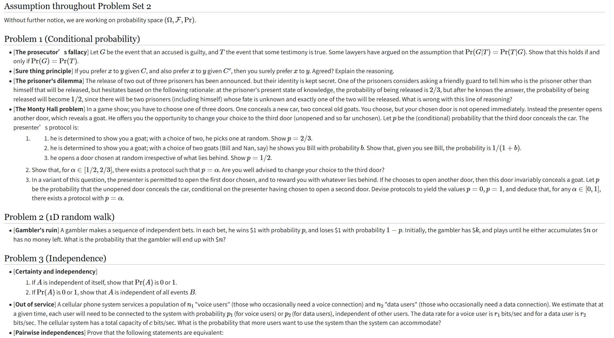
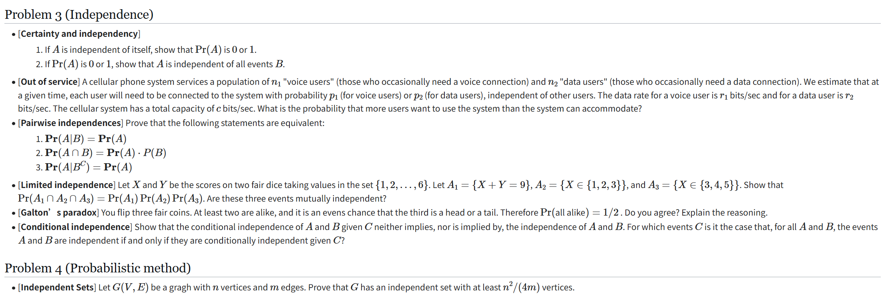

# 241880334 闵振昌 25FA2
## Problem 1
### The Prosecutor's Fallacy
For conditional probabilities we have:
$$
Pr(G|T)=\frac{Pr(G\cap T)}{Pr(T)}=\frac{Pr(T|G)Pr(G)}{Pr(T)}
$$
So if $Pr(G|T)=Pr(T|G)$, then $\frac{Pr(G)}{Pr(T)}=1$
So if $Pr(G|T)=Pr(T|G)$, then $Pr(G)=Pr(T)$

And as this is an equation, given $Pr(G)=Pr(T)$ we can infer that $Pr(G|T)=Pr(T|G)$

### Sure Thing Principle
I agree, as $C\cup C^c=\Omega$ is a certain event, covering all the possible situations.
And given that x outperforms y in all situations, then preferring x to y can be inferred.

### The Prisoner's Dilemma
The problem is that after he knew who would be released other than him, the probability turns into a conditional probability instead of a normal one.
Without asking, the probability of himself being released is $\frac{2}{3}$ and that is correct.

Let the asking prisoner be A and other two be B and C.
The probability of A being released after asking can be calculated as:
$$
Pr(A|B \text{getting out}) = Pr(A|C \text{getting out})=\frac{\frac{1}{3}}{\frac{1}{3}+\frac{1}{6}}=\frac{2}{3}
$$

### The Monty Hall Problem
1. (1) There're 3 situations in general, if the car is in the chosen door, then the probability of A getting the car in the third one is 0. But if in other 2 situations when the chosen door is goat, we would definitely get one car in the third door, so it is easy to get $p=\frac{2}{3}$

(2) We can know if we see Bill, we either choose Nan's door or we chose a car's door and the host reveals Bill.
If we've chose Nan's door, then the probability of getting the car is 1
If we've chose a car's door, then the probability of getting the car is 0.
Probability of seeing Bill and car in third door can be inferred as only when we've chosen Nan's door initially, and we'll definitely get the car in the third door cuz Bill is already revealed.
So the conditional probability is $\frac{Pr(\text{We see Bill and car in third door})}{Pr(\text{We see Bill})}=\frac{\frac{1}{3}}{\frac{b}{3}+\frac{1}{3}}=\frac{1}{b+1}$

(3)Firstly we need to make sure the one we chose initially contains a goat, not a car, or we will never get a car in the third door, and this probability is $\frac{2}{3}$
And then the probability of getting the car in the third door is $\frac{2}{3}\times\frac{1}{2}=\frac{1}{3}$
And the probability of the host revealing a goat is $\frac{1}{3}+\frac{2}{3}\times\frac{1}{2}=\frac{2}{3}$
So $p=\frac{\frac{1}{3}}{{\frac{2}{3}}}=\frac{1}{2}$

2.  
