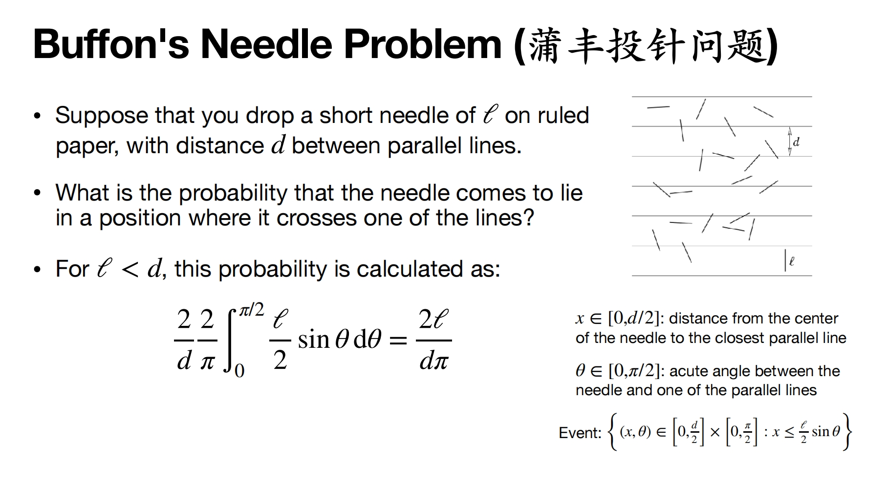

# Lec1 Course Intro

Probability and Statistics for Computer Science

## Sample Problems

### Fair Coins from Biased

John von Neumann (1951): “Suppose you are given a coin for which the probability of HEADS, say p, is **unknown**. How can you use this coin to generate unbiased (fair) coin-flips.”
Construct two equally probable events (without knowing p):

- Flip the coin twice and check the pair:
- If the pair is (H, T): Treat this as a "fair Heads" (output H).
- If the pair is (T, H): Treat this as a "fair Tails" (output T).
- If the pair is (H, H) or (T, T): Discard the pair (it’s useless for fairness) and start over with two new flips.

### The Two Child Problem

Martin Gardner (1959): "Knowing that I have two children and at least one of them is girl, what is the probability that both children are girls?"
Understand the probability space:
(M, M), (M, F), (F, M), (F, F)
So the answer is 1/3.

### Monty Hall Problem(three doors problem)

Whether the host opens the door with a car or a goat, and whether to switch the door.

### Bertrand Paradox

What is the probability that a random chord of a circle, is longer than the side of a equilateral triangle inscribed in a circle?
Method I: Keep one point fixed, and move the other point to form random chords. And this prob = 1/3.
Method II: get one equilateral triangle inscribed in a circle, then get perpendicular bisector of one side of the triangle, and the chord moves on the bisector. And this prob is 1/2.

This paradox differs because they are two different ways to get a random chord, and The notion of "random chord of a
circle" shall be more rigorously defined.

### Buffon's Needle Problem

## Probability Space

### Sample Space
Sample Space $\Omega$: **set** of **all possible outcomes** of an experiment(set of **samples**)
Example: all six sides of a dice; all outcomes of a sequence of coin tosses;...
Each $\omega \in \Omega$ is called a **sample** or **outcome** of the experiment.
An **event** is a subset A of $\Omega$.

For **discrete probability space** (where Ω is finite or countably infinite):
- probability mass function (pmf) p: $\Omega \rightarrow[0,1]$, satisfying $\Sigma_{\omega \in \Omega}p(\omega)=1$
- the probability of event $A\subseteq \Omega$ is given by $Pr(A) = \Sigma_{\omega \in A}p(\omega)$

$2^{\Omega}$: The collection of **all possible subsets** of $\Omega$, including the empty set and Omega itself.

- $\Phi$ is the impossible event
- $\Omega$ is the certain event
- If $A$ is an event, then $A^{c}$ is an event
- If $A_1, A_2, \dots, A_n \in \Sigma$, then $A_1 \cap A_2 \cap \dots \cap A_n \in \Sigma$
- If $A_1, A_2, \dots, A_n \in \Sigma$, then $A_1 \cup A_2 \cup \dots \cup A_n \in \Sigma$

### $\sigma$-Algebra
A family $\Sigma$: subsets of $\Omega$ is called a **$\sigma$-algebra** if:
- $\Phi \in \Sigma$
- $\Omega \in \Sigma$
- If $A \in \Sigma$, then $A^{c} \in \Sigma$, $A^{c} = \Omega \setminus A$, in omega and not in A.
- If $A_1, A_2, \dots, A_n \in \Sigma$, then $A_1 \cup A_2 \cup \dots \cup A_n \in \Sigma$

Examples: $\Sigma = \{ \Phi, \Omega, A, A^{c}\}$

### Probability Measure
Let $\Sigma\subseteq 2^\Omega$ be a $\sigma$-algebra.
A probability measure (also called probability law) Pr on sample space $\Omega$ (with events $\Sigma$) is a function Pr : $\Sigma\rightarrow$[0,1] satisfying:
- Normalized: $Pr(\Omega) = 1$
- Additive for disjoint $A_{1}, A_{2}, \dots\in\Sigma$ : Pr($\cup_{i}A_{i}$) = $\Sigma_{i}Pr(A_{i})$

The triple $(\Omega, \Sigma, Pr)$ is called a **probability space**.

### Basic Properties of Probability
- Pr($A^{c}$) = 1 - Pr($A$)
- Pr($\Phi$) = 0
- Pr($\Omega$) = 1
- Pr(A\B) = Pr(A) - Pr($A\cap B$)
- $A\subseteq B$ $\rightarrow$ Pr($A$) $\leq$ Pr($B$)
- Pr($A_1 \cup A_2 \cup \dots \cup A_n$) = Pr($A_1$) + Pr($A_2$) + $\dots$ + Pr($A_n$)

### Union Bond
Also known as Boole's inequality.
for events $A_1, A_2, \dots, A_n \in \Sigma$:
Pr($\cup_{i}A_{i}$) $\leq$ $\Sigma_{i}Pr(A_{i})$
Example: A machine has parts, each of which breaks down with probability $p$.
What is the probability that the machine will work?
Pr[All parts are fine] = 1 - Pr[At least one part breaks down] $\leq 1-np$

### Principles of Inclusion-Exclusion
For events $A_1, A_2, \dots, A_n \in \Sigma$:
Pr($\cup_{i}A_{i}$) = $\Sigma_{i}Pr(A_{i})$ - $\Sigma_{i<j}Pr(A_{i}\cap A_{j})$ + $\Sigma_{i<j<k}Pr(A_{i}\cap A_{j}\cap A_{k})$ - $\dots$=
$\Sigma_{i=1}^n(-1)^{n-i}Pr(A_1\cap A_2\cap \dots \cap A_i)$

Another representation: $\Pr(\bigcup_{i = 1}^{n}A_i)=\sum_{k = 1}^{n}(-1)^{k - 1}\sum_{S \in \binom{\{1,2,\cdots,n\}}{k}}\Pr(\bigcap_{i \in S}A_i)$
$\sum_{S \in \binom{\{1,2,\cdots,n\}}{k}}\Pr(\bigcap_{i \in S}A_i)$ means that we select $k$ events from $n$ events and calculate the probability that all $k$ events happen. All selections should be calculated.

### Derangement
The probability that a random permutation has no fixed point, there is no i that $\pi(i) = i$.
Pr gets to $\frac{1}{e}$ when n gets to infinity.

The total permutations of n elements is n!.
To get the probability of derangement, we need to count the number of derangements.

Let $A_i$ representing the event that $\pi(i) = i$.
We use Inclusion-Exclusion Principle, when at least 1 element sits in its original place:
$Pr(\cup_{i=1}^nA_i) = \sum_{k=1}^n(-1)^{k-1}\sum_{S \in \binom{\{1,2,\cdots,n\}}{k}}\Pr(\bigcap_{i \in S}A_i)$
For$\sum_{S \in \binom{\{1,2,\cdots,n\}}{k}}\Pr(\bigcap_{i \in S}A_i)$ ，selecting k elements from n elements, making all k elements in their original place, so the rest n-k elements can be randomly placed, (n-k)!

$\Pr(\bigcup_{i = 1}^{n}A_i)=\sum_{k = 1}^{n}\binom{n}{k}(-1)^{k - 1}\frac{(n - k)!}{n!}$ ，further eliminated to $-\sum_{k = 1}^{n}\frac{(-1)^{k}}{k!}$

So the probability of derangement $Pr(\bigcap_{i = 1}^{n}A_i^c) = 1 - Pr(\bigcup_{i = 1}^{n}A_i) = 1+\sum^n_{k=1}\frac{(-1)^k}{k!}=\sum_{k=0}^n\frac{(-1)^k}{k!}$

### Classical Examples of Probability Space
#### Classic Probability
For finite sample space $\Omega$, each outcome $a\in\Omega$ has equal probability.
Pr($a$) = $\frac{|A|}{|\Omega|}$
#### Geometric Probability
continuous probability space where is $Pr(A)$calculated as some geometric measure of $A$
