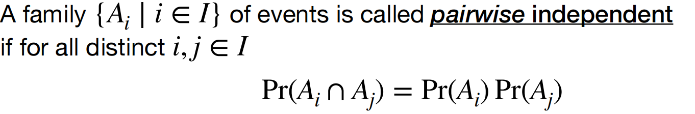
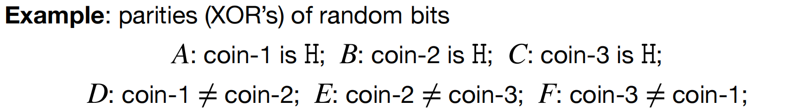
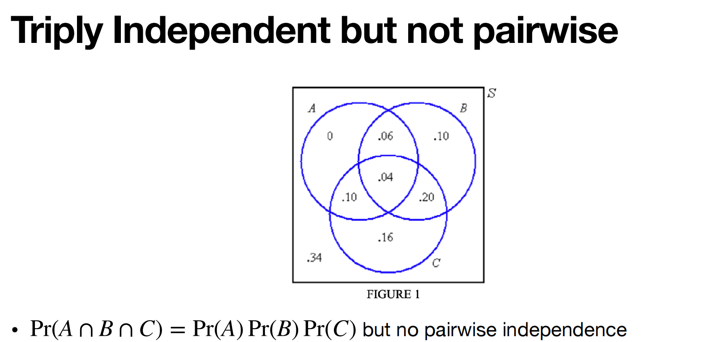
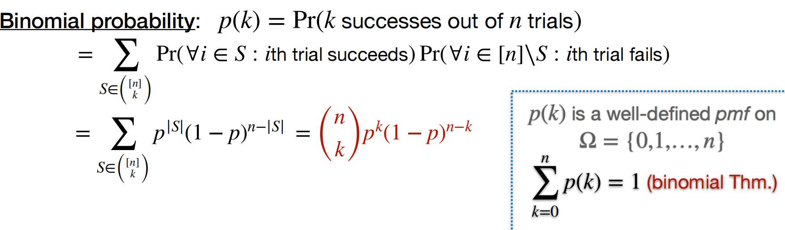

# Lec2: Probability Space
## Probability Space(review)
For `discrete probability space`, $\Omega$ is finite or countably infinite.

## Probability Space and Measure(review)
A probability measure, aka probability law, is a function $Pr: \Sigma \to [0, 1]$ such that:
- $Pr(\Omega) = 1$
- $Pr(A1 \cup A2 \cup ... \cup An) = Pr(A1) + Pr(A2) + ... + Pr(An)$

## Classical Probability
For every event $A \in \Omega$, $Pr(A) = \frac{|A|}{|\Omega|}$

## Geometric Probability
For every event $A \in \Omega$, $Pr(A) = \frac{Vol(A)}{Vol(\Omega)}$

## Ramsey Theory
In any party of six people, there are either three people mutually strangers or at least three of them are mutual acquaintances.
Any 2-coloring of $K_{6}$ has a monochromatic triangle $K_{3}$.

Any 2-coloring of $K_{n}$ has a monochromatic triangle $K_{k}$.
Ramsey number $R(k, k)$ is the smallest number $n$ that satisfy.
In this case, we see R(3, 3) = 6

## Probabilistic Method
If $C^{n}_{k}2^{1-(C^{k}_{2})} < 1$, then $\exists$ 2-coloring of $K_{n}$ with no monochromatic $K_{k}$ subgraph.
Proof:
- For each subset $S \subseteq k$, define $A_{S} = {K_{S} monochromatic}$, then $Pr(A_S)$ is $2^{1-(C^{k}_{2})}$.
- By Union Bond: $Pr(\bigcup_{S \subseteq k} A_S) \leq C^{n}_{k}2^{1-(C^{k}_{2})}$
- By assumption, $Pr(\bigcup_{S \subseteq k} A_S) < 1$
- By Chebyshev's Inequality: $Pr(\bigcup_{S \subseteq k} A_S) \geq 1 - (1 - Pr(\bigcup_{S \subseteq k} A_S))^{n}$
- Hence, $\exists$ 2-coloring of $K_{n}$ with no monochromatic $K_{k}$ subgraph.

## Conditional Probability
The probability of an event $A$ given that $B$ has occurred is defined as $Pr(A|B) = \frac{Pr(A \cap B)}{Pr(B)}$.
$Pr(B)$ must be greater than 0.

### Fair Coin
Let's say a coin whose probability of landing heads is $p$, unknown, how to generate an unbiased coin-flip?
We can flip the coin twice, if the result is HH or TT, we flip it again.
If the result is HT or TH, we output the result.
This is a conditional probability, and we can prove it:
$Pr(HT|\{HT,TH\}) = Pr(TH|\{HT,TH\}) = \frac{p(1-p)}{2p(1-p)}=\frac{1}{2}$

### The Two Child Problem
Knowing that I have two children and at least one of them is girl, what is the probability that both children are girls?
$Pr(Both | AtLeastOneGirl) = \frac{Pr\{GG\}}{Pr\{GG,GB,BG\}} = \frac{\frac{1}{4}}{\frac{3}{4}} = \frac{1}{3}$

## Laws of Conditional Probability
$Pr(A \cup C) \leq Pr(A) + Pr(C)$ translates to the new fact 
$P(A \cup C | B) \leq P(A | B) + P(C | B)$.

### Chain Rule
$Pr(\cap_{i=1}^{n} A_{i}) = Pr(A_{1})Pr(A_2|A_1)Pr(A_3|A_1\cap A_2)\dots Pr(A_n|\cap_{i=1}^{n-1}A_i)$

### Law of Total Probability
Let $B_1, B_2\dots B_n$ be a partition of $\Omega$, and $Pr(B_i)>0$ for all i
$Pr(A) = \sum_{i=1}^n Pr(A\cap B_i) = \sum_{i=1}^n Pr(A|B_i)Pr(B_i)$

### Bayes' Law
$Pr(A|B) = \frac{Pr(B|A)Pr(A)}{Pr(B)}$

## Independence
The occurrence of event B changes the probability of event A, from Pr(A) to Pr(A | B)
When A and B are independent, $Pr(A|B) = Pr(A)$
i.e. $Pr(A \cap B) = Pr(A)Pr(B)$

If A and B are independent, so are A and $B^c$.

### Conditional Independence
$Pr(A \cap B | C) = Pr(A | C)Pr(B | C)$
i.e. $Pr(A|B\cap C)=Pr(A|C)$

### Independence of Several Events
$Pr(A \cap B \cap C) = Pr(A)Pr(B)Pr(C)$
$Pr(\cap_{i=1}^{n} A_{i}) = \prod_{i=1}^{n} Pr(A_{i})$

## Product Probability Space
Product Probability Space is a probability space constructed from a sequence of **independent experiments**.
Consider discrete probability spaces $(\Omega_1, p_1), (\Omega_2, p_2), \dots, (\Omega_n, p_n)$
The product probability space $(\Omega, p)$ is defined as $( \Omega_1 \times \Omega_2 \times \dots \times \Omega_n, p_1 \times p_2 \times \dots \times p_n )$. **cartesian product** to form the sample space.

Experiments are independent, so p would be the product of the individual probabilities.
$\forall \omega\in\Omega, p(\omega) = p_1(\omega_1) \times p_2(\omega_2) \times \dots \times p_n(\omega_n)$

What is a probability mass function?
Would be discussed in lec3!
Used to describe probability measure for discrete random variables.

## Limited Independence
We need to clarify two kinds of independence: Pairwise independence and Mutual independence.

Mutually independent events must be pairwise independent.
Pairwise independence insures that any two events are independent, while not concluding multi-events.

Like in this case, D and E, D and F, E and F are pairwise independent, but not mutually independent, cuz $Pr(D\cap E\cap F)=Pr(D)Pr(E)Pr(F)$ is not right

## Error-Reduction

### Decision problem
Given a binary sequence of any length $\{0,1\}^*$, and output 0 or 1.
Example: input a binary form of a number and output whether it is a prime number.

### One-sided error
Monte Carlo randomized algorithm $\mathcal{A}$ whose core is one-sided error.

One-sided error: If the right answer is 1, i.e. f(x)=1, $\mathcal{A}$ always outputs 1 (no error)
If the right answer is 0, i.e. f(x)=0, $\mathcal{A}$ may output 0 with probability $Pr(\text{correct}) \geq p$
That is, the probability of $\mathcal{A}$ outputting 1 when f(x)=0 is at most $1-p$, and this is the probability of error.
As the error only happens on the side when correct answer is 0 while outputting 1 incorrectly.
On the other side the algorithm works very well.

### Strategy to Reduce Error
Let $\mathcal{A}^n$ be the algorithm $\mathcal{A}$ run $n$ times independently, and return $\bigwedge$ of the $n$ outputs.

When the correct answer is 0, the probability of the new algorithm $\mathcal{A}^n$ outputting 1 $Pr(\mathcal{A}^n(x)=1)\leq(1-p)^n$, because every run outputting 1 has a probability not bigger than $1-p$, and n runs are done independently.

To get the error probability $(1-p)^n \leq\epsilon$, the times $n$ needs to satisfy:
$n≈\frac{1}{p}\ln(1/\epsilon)$ (use Taylor expansion of $ln(1-p)$)

## Binomial Probability
Consider independent tosses of a coin, in which each coin toss returns HEADs independently with probability $p$.
We say that we have a sequence of **Bernoulli trials**, in which each trial succeeds with probability $p$.

## Error-Reduction(two-sided case)
Now we've got an algorithm $\mathcal{A}$ which could make error on both sides.
Assume $f(x)$ is the right answer, and $\mathcal{A}(x)$ is the algorithm output.
$Pr(\mathcal{A}(x)=f(x))\geq\frac{1}{2}+p$, slightly bigger than 1/2

Let $\mathcal{A}^n$ be running $\mathcal{A}$ $n$ times and return the **majority** of the n outputs(like in 5 runs it returns 1 for 3 times, then return 1 for $\mathcal{A}^5$)

$Pr(\mathcal{A}^n(x)\neq f(x))\leq\sum_{k<\frac{n}{2}}$
$k<\frac{n}{2}$ means that the times of getting right answers is less than half, so getting majority would return an error.
Like in `5` runs, if $f(x)=1$, and we got `0` for 3 or 4 or 5 times, then $\mathcal{A}^5(x)$ would return 0, which is an error, and `k` as the successful number of runs, would be 2, 1 and 0 respectively.

Further execute on the inequality we would get close to $Pr(\mathcal{A}^n(x)\neq f(x))\leq exp(-p^2n)$
To make the error rate smaller than $\epsilon$, we need $n\geq\frac{1}{p^2}\ln(1/\epsilon)$