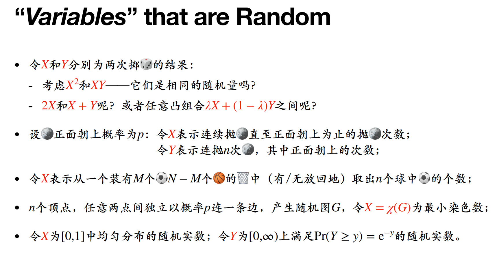
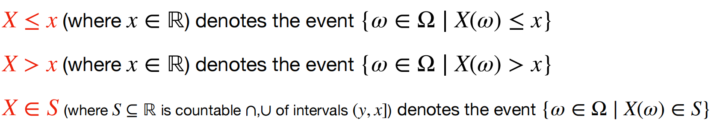
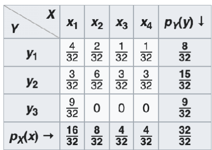
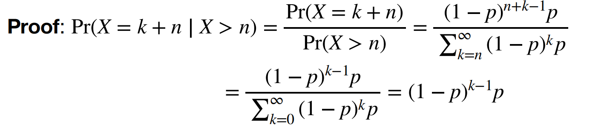

# Lec3: Random Variable

## Random Variable

On the given probability space $(\Omega, \Sigma, Pr)$, a random variable $X$ is a function from $\Omega$ to $\mathbb{R}$, satisfying:
for $x\in\mathbb{R}$, any set $\{\omega\in\Omega|X(\omega)\leq x\}$ is in $\Sigma$, i.e., $X$ is $\Sigma$-measurable.

Random variables in fact turning every sample in sample space $\Omega$ into a number in $\mathbb{R}$

*Why we need $\Sigma$-measurable?*
We want to calculate the probability of inequalities like $X\leq 2$, and the set must be in $\Sigma$, or we cannot calculate it based on our definition of probability.

For example, suppose we have $\Omega=\{a,b,c\}$, and $\Sigma=\{\emptyset, \{a\},\{b,c\},\Omega\}$.
Now we define a random variable $Y:\Omega\to\mathbb{R}$, such that $Y(a)=1, Y(b)=2, Y(c)=3$.
We consider the event $Y\leq 2$, and the set is $\{\omega\in\Omega|Y(\omega)\leq 2\}=\{a,b\}\notin\Sigma$
So we can know that Y is not $\Sigma$-measurable, and we cannot calculate $Pr(Y\leq 2)$.

Symbols:

For discrete random variable $X: \Omega\to\mathbb{Z}$, which means that $X$ can only be discrete numbers, like an integer.
As they're discrete, $S$ can be any subset of $\mathbb{Z}$, and $Pr(X\in S)$ is the sum of $Pr(X\in S_i)$ for every $S_i\in S$

Example: take six fair dice, and let $X$ be the sum of the numbers on the top faces.
Then $X$ is a discrete random variable, and $Pr(X=k)=1/6$ for $k=1,2,3,4,5,6$.
Let $S=\{2,4,6\}$, then $Pr(X\in S)=Pr(X=2)+Pr(X=4)+Pr(X=6)=1/3$.

### Distribution
The (Cumulative) Distribution Function (CDF) of a random variable:

$$
F_X(x)=Pr(X\leq x)
$$

All probabilities about random variables are defined in terms of CDF, and the original probability space is no longer needed.

Two random variables $X$ and $Y$ are **identically distributed** if $F_X = F_Y$

CDF is:
- Monotone: $F_X(x)\leq F_X(y)$ if $x\leq y$
- Bounded: $\lim\limits_{x\to -\infty}F_X(x) = 0$ and $\lim\limits_{x\to \infty}F_X(x) = 1$

### Discrete Random Variable
A random variable $X$ is **discrete** if $X(\Omega)$ is countable.
$X(\Omega)$ is the set of all possible values of $X$.

For a discrete random variable $X$, the **probability mass function** (PMF) is defined as:

$$
p_X(x)=Pr(X=x)
$$

And the CDF satisfies:
$$
F_X(y)=\sum\limits_{x'\leq y}p_X(x')
$$

### Continuous Random Variable
A random variable $X$ is **continuous** if its CDF can be expressed as:

$$
F_X(y) = Pr(X \leq y) = \int_{-\infty}^{y} f_X(x) \, dx
$$
which $f_X$ is the **probability density function** (PDF) of $X$.

There are random variables that are neither discrete nor continuous.

### Independence
If for $X,Y$ random variables, events $X=x$ and $Y=y$ are independent events for all x and y, then $X$ and $Y$ are mutually independent.

If for $X_1,X_2,\dots,X_n$ random variables, events $X_1=x_1,X_2=x_2,\dots,X_n=x_n$ are independent events for all $x_1,x_2,\dots,x_n$, then $X_1,X_2,\dots,X_n$ are mutually independent.
And we have the equation of their pmf:
$$
p_{(X_1,X_2,\dots,X_n)}(x_1, x_2,\dots,x_n)=Pr(X_1=x_1 \cap X_2=x_2\dots X_n=x_n)=p_{X_1}(x_1)p_{X_2}(x_2)\dots p_{X_n}(x_n)
$$

For general random variables, replace $X_i=x_i$ with $X_i\leq x_i$, and we got the definition of independence.

### Random Vector
Given $(\Omega, \Sigma, Pr)$, a random vector $X=(X_1,X_2,\dots,X_n)$ is a vector composed of multiple random variables $X_i$

The **joint CDF** $F_X(x_1,x_2,\dots,x_n)$ is defined as:
$$
F_X(x_1,x_2,\dots,x_n)=Pr(X_1\leq x_1 \cap X_2\leq x_2 \cap \dots \cap X_n\leq x_n)
$$
This can be viewed as a joint probability when all sub-random variables are no more than the given values, so we use \cap to join them together.

For discrete random vector, the **joint mass function** (PMF) is defined as:
$$
p_{(X_1,X_2,\dots,X_n)}(x_1, x_2,\dots,x_n)=Pr(X_1=x_1 \cap X_2=x_2\dots X_n=x_n)
$$

The marginal distribution of $X_i$ in $X=(X_1,X_2,\dots,X_n)$ is defined as:
$$
p_{X_i}(x_i)=\sum_{x_1,\dots x_{i-1}, x_{i+1}, \dots,x_n} p_{(X_1\dots X_n)}(x_1\dots x_n)
$$

In this case, we wonna calculate the marginal distribution, then we just sum up one line or a column and we could get the answer.
Like in column1, we want to get $p_{X_1}(x_1)$, so we view $Y$ as another random variable and add up all pmf in column1.

## Discrete Random Vector

### Probability Mass Function (PMF)
- As histogram: $p_{X}$ can be viewed as the histogram of the probability distribution.
- As vector: $p_{X}$ can be viewed as a vector $p_{X}\in[0,1]^{R}$, where R is the set of all possible values of $X$, and the sum of $x_i$ in $p_{X}$ is 1.

If $Y=f(X)$, Y is also a random variable, and its pmf is:
$$
p_{Y}(y)=\sum_{x: f(x)=y}p_{X}(x)
$$
That is the sum of all pmf where $f(x)=y$.

### Bernoulli Trial
A bernoulli trial is an experiment with two possible outcomes: success or failure.
A **bernoulli random variable** $X$ takes in values in $\{0,1\}$, and its pmf is:
$$
p_{X}(k)=Pr(X=k)=
\begin{cases}
p,&\text{if } k=1\\
1-p,&\text{if } k=0
\end{cases}
$$
where $p$ is a parameter representing the probability of success.

Indicator: For event $A$, its indicator random variable $X$ is defined as:
$$
X=I(A)\begin{cases}
1,&\text{if } A\\
0,&\text{if } \neg A
\end{cases}
$$

### Binomial Distribution
$X$: number of successes in $n$ i.i.d. (independent and identically distributed) Bernoulli trials with parameter $p$
A binomial random variable $X$ takes value in $\{0,1,\dots n\}$, and its pmf is:
$$
p_{X}(k)=Pr(X=k)=\binom{n}{k}p^k(1-p)^{n-k},\text{if } k=0,1,2,\dots,n
$$
We say that $X$ follows the **binomial distribution** with parameters $n$ and $p$, denoted $X\sim B(n,p)$ or $B(n,p)$.

### Geometric Distribution
$X$: number of Bernoulli trials until the first success in i.i.d. Bernoulli trials with parameter $p$

Example: trials needed to get one HEADS in a sequence of coin flips

A geometric random variable $X$ takes value in $\{1,2,\dots\}$, and its pmf is:
$$
p_{X}(k)=Pr(X=k)=(1-p)^{k-1}p,\text{if } k=1,2,\dots
$$
We say that $X$ follows the **geometric distribution** with parameter $p\in[0,1]$, denoted $X\sim Geo(p)$ or $Geometric(p)$.

Geometric distribution is memoryless: for $k\geq 1$,$n\geq 0$
$$
Pr(X=k+n|X>n)=Pr(X= k)
$$
That is, if we didn't get a success in the first $n$ trials, the probability of getting a success in the next $k$ trials is the same as the probability of getting a success in the very beginning $k$ trials.
This is like having no memory cuz past trials don't affect the future trials.

Geometric distribution is the only **discrete memoryless distribution** with the range of values $\{1,2,\dots\}$.

