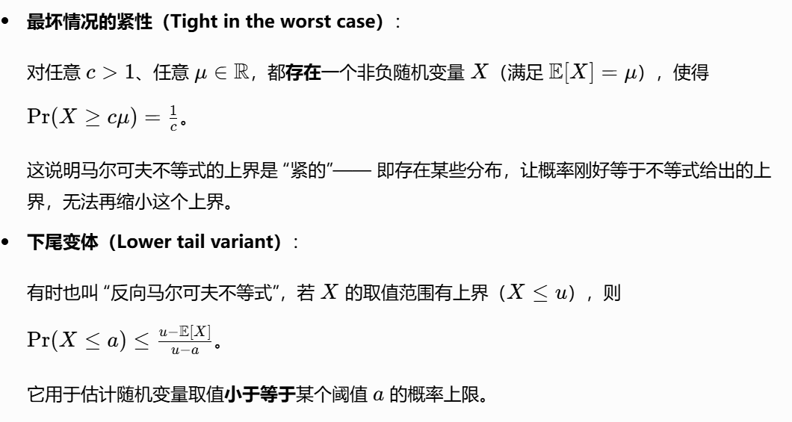

# Lec4: Deviation
## Markov's Inequality
Let $X$ be a non-negative random variable. Then for any $a > 0$,
$$
Pr(X \geq a) \leq \frac{E[X]}{a}
$$
Use indicator to prove: Let $I = \mathbb{I}(X \geq a)$. Then
$$
I = I(X \geq a) \leq \left\lfloor \dfrac{X}{a} \right\rfloor \leq \dfrac{X}{a}.
$$
Therefore, $\Pr(X \geq a) = \mathbb{E}[I] \leq \mathbb{E}\left[\frac{X}{a}\right] = \frac{\mathbb{E}[X]}{a}$

Corollary: for $c > 1$, we have:
$$
Pr(X\geq cE[X]) \leq \frac{E[X]}{cE[X]} = \frac{1}{c}
$$

